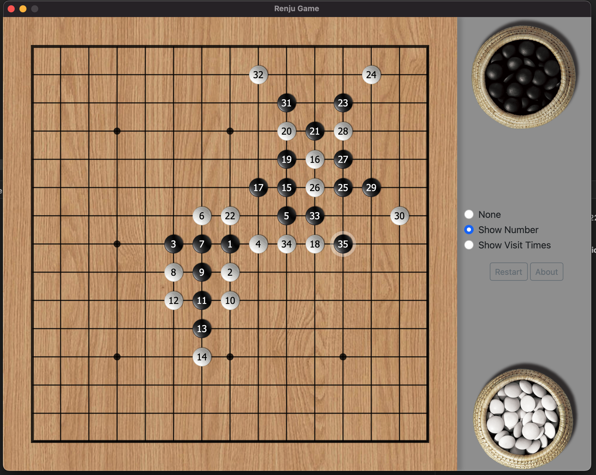

# A reinforcement-learning based Renju game

Renju is a professional variant of gomoku(five in a row) by adding following restrictions to black stones to weaken the advantages of the first player in the game. 

* Double three – Black cannot place a stone that builds two separate lines with three black stones in unbroken rows (i.e. rows not blocked by white stones).
* Double four – Black cannot place a stone that builds two separate lines with four black stones in a row.
* Overline – six or more black stones in a row.

This is my personal project to practice reinforcement learning. You can download the application and play with it.

## Overview

* The game AI is implemented using residual Convolutional Neural Network and Monte Carlo Tree Search. 
* AI is not told how to play game. AI learns how to play the game by playing with itself (a.k.a Self Player).
* The application is developed in Rust language to avoid performance bottleneck in Python for MCTS. 
* Algorithm design is copied and modified from Alpha Go Zero 
    * [AlphaGo: How it works technically?](https://jonathan-hui.medium.com/alphago-how-it-works-technically-26ddcc085319)
    * [AlphaZero - A step-by-step look at Alpha Zero and Monte Carlo Tree Search](https://joshvarty.github.io/AlphaZero/)
    * [AlphaGo Zero — a game changer. (How it works?)](https://jonathan-hui.medium.com/alphago-zero-a-game-changer-14ef6e45eba5)
    * Lessons From Alpha Zero [1](https://medium.com/oracledevs/lessons-from-implementing-alphazero-7e36e9054191) [2](https://medium.com/oracledevs/lessons-from-alphazero-connect-four-e4a0ae82af68) [3](https://medium.com/oracledevs/lessons-from-alphazero-part-3-parameter-tweaking-4dceb78ed1e5) [4](https://medium.com/oracledevs/lessons-from-alphazero-part-4-improving-the-training-target-6efba2e71628) [5](https://medium.com/oracledevs/lessons-from-alpha-zero-part-5-performance-optimization-664b38dc509e) [6](https://medium.com/oracledevs/lessons-from-alpha-zero-part-6-hyperparameter-tuning-b1cfcbe4ca9a)

## CNN

